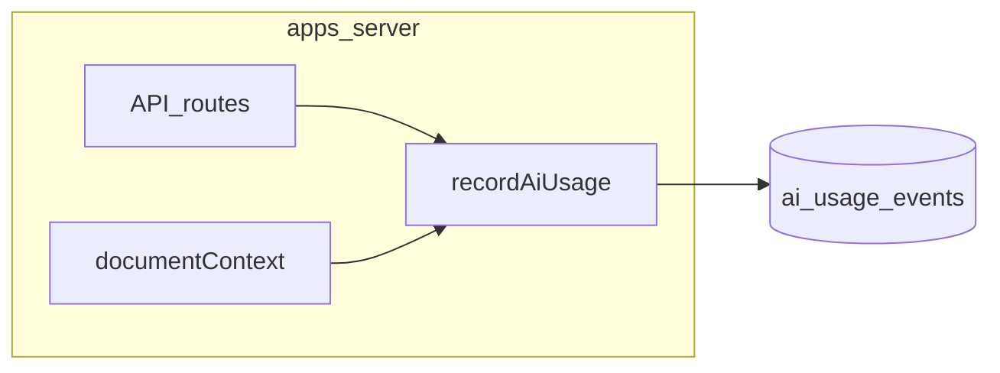

# AI Token 计量：分阶段实现计划

本文档描述如何在 **Next.js 服务端（`apps/server`）** 为已登录用户记录各 AI 调用的 token 用量，供后续 Agent **按阶段逐步实现**。全量 AI 入口清单见 [ai-usage-inventory.md](./ai-usage-inventory.md)。

**第一期默认策略**：先 **记录（metering）**，限额（enforcement）可后置；计量写入失败 **不得影响**主业务流程（catch 后打日志即可）。

---

## 1. 目标与范围

### 1.1 目标

- 为每个 `user_id` 持久化单次或单次会话内多轮调用的 **input/output tokens**（及可选 `metadata`），便于按月汇总、对账与后续限额。
- **供应商字段统一**：Anthropic `usage.input_tokens` / `output_tokens` 与 OpenAI `usage` 各形态在写入前归一成同一套列。

### 1.2 本期纳入

[`apps/server`](../apps/server) 内能通过 Bearer 或调用链解析 **`user_id`** 的路径，与 [ai-usage-inventory.md](./ai-usage-inventory.md) **§2（用户直连）**、**§3 中由 Next 进程触发的 `documentContext`** 对齐，具体见下表「阶段实现」。

### 1.3 本期明确排除

- **Supabase Edge Functions**（Deno）：如 `weekly-summary`、`monthly-summary`、`generate-weekly-report`、`generate-monthly-report`、`process-document-queue`、`backfill-summaries` 等。**不修改** `supabase/functions/**`。
- 理由：多为定时/批处理；二期再接时，队列/job 已带 `user_id` 即可用同一表追加写入。

### 1.4 二期预留

表 `ai_usage_events` 建议预留 **`source`**（如 `next_server` | `edge`）或 **`environment`**，便于 Edge 接入后与 Next 区分，无需改表。

---

## 2. 数据模型（阶段 0）

### 2.1 表：`ai_usage_events`（建议名）

| 列 | 类型 | 说明 |
|----|------|------|
| `id` | `uuid` PK | `gen_random_uuid()` |
| `user_id` | `uuid` NOT NULL | `auth.users` 引用 |
| `feature` | `text` NOT NULL | 见 §3.1 枚举 |
| `provider` | `text` NOT NULL | `anthropic` \| `openai` |
| `model` | `text` NOT NULL | 实际模型名 |
| `input_tokens` | `integer` NOT NULL DEFAULT 0 | |
| `output_tokens` | `integer` NOT NULL DEFAULT 0 | |
| `metadata` | `jsonb` | 可选：`route`、`request_id`、`deepAnalysis`、`completion_index` 等 |
| `created_at` | `timestamptz` | 默认 `now()` |

可选：`billing_period`（`text`，如 `2026-04`）或生成列，便于按月索引。

### 2.2 安全与写入

- 写入仅通过 **服务端 `supabaseAdmin`（service role）**），与 [apps/server/lib/supabase.ts](../apps/server/lib/supabase.ts) 一致。
- **RLS**：默认可禁止 anon/authenticated 直接写；若需用户读自己的汇总，再提供 **只读视图** 或 **专用 API** 聚合。

### 2.3 迁移文件

- 路径：[supabase/migrations/](../supabase/migrations/)，文件名取 **当前最大序号 + 1**（实现时以仓库为准，例如 `027_ai_usage_events.sql`）。
- **已添加**：[`027_ai_usage_events.sql`](../supabase/migrations/027_ai_usage_events.sql)（含 `source` 默认 `next_server`、RLS 开启无 policy）。

---

## 3. 服务端共用模块（阶段 0）

### 3.1 `feature` 枚举（字符串常量）

与 HTTP 路由对应关系：

| `feature` | 路由 / 位置 | 说明 |
|-----------|-------------|------|
| `health_record_meta` | `POST /api/health-record-meta` | [health-record-meta/route.ts](../apps/server/app/api/health-record-meta/route.ts) |
| `transcribe` | `POST /api/transcribe` | [transcribe/route.ts](../apps/server/app/api/transcribe/route.ts) |
| `profile_document_analyze` | `POST /api/profile-document-analyze` | [profile-document-analyze/route.ts](../apps/server/app/api/profile-document-analyze/route.ts) |
| `chat` | `POST /api/chat` | [chat/route.ts](../apps/server/app/api/chat/route.ts) |
| `document_context_full` | `documentContext.ts` 全量 | [documentContext.ts](../apps/server/lib/documentContext.ts) |
| `document_context_incremental` | `documentContext.ts` 增量 | 同上 |

### 3.2 共用模块（已实现）

**[`apps/server/lib/aiUsage.ts`](../apps/server/lib/aiUsage.ts)**：

```ts
// 示意签名 — 实现时以项目类型为准
recordAiUsage(params: {
  userId: string;
  feature: string;
  provider: "anthropic" | "openai";
  model: string;
  inputTokens: number;
  outputTokens: number;
  metadata?: Record<string, unknown>;
}): Promise<void>;
```

- 内部：`supabaseAdmin.from("ai_usage_events").insert(...)`；可选参数 **`source`**（默认 `next_server`）。
- 辅助函数：`tokensFromAnthropicUsage`、`tokensFromOpenAIChatUsage`、`tokensFromOpenAIUsageLoose`（Audio 等无标准 token 时配合 `metadata`）。
- **Anthropic**：从 Messages 响应 `usage: { input_tokens, output_tokens }` 取值。
- **OpenAI Chat**：从 `usage.prompt_tokens` / `completion_tokens`（或新版字段名）映射到 `input_tokens` / `output_tokens`。
- **OpenAI Audio**：若无标准 token，将原始 `usage` 或时长写入 `metadata`，并在本文档或代码注释中说明。

### 3.3 失败策略

- `recordAiUsage` 内 **try/catch**：失败只 `console.error`，**不 throw**，避免影响 API 响应。

---

## 4. 分阶段实现顺序

每个阶段可单独 PR / 单独交给 Agent；完成后再做下一阶段。

| 阶段 | 模块 | 主要文件 | 要点 |
|------|------|----------|------|
| **0** | 表 + `recordAiUsage` | [`027_ai_usage_events.sql`](../supabase/migrations/027_ai_usage_events.sql)、[`aiUsage.ts`](../apps/server/lib/aiUsage.ts) | 部署迁移后 SQL / 临时调用 `recordAiUsage` 验证 |
| **1** | Health record 元数据 | [apps/server/app/api/health-record-meta/route.ts](../apps/server/app/api/health-record-meta/route.ts) | 单次 Anthropic Messages；`feature: health_record_meta`；**已实现** `recordAiUsage` |
| **2** | 语音转写 | [apps/server/app/api/transcribe/route.ts](../apps/server/app/api/transcribe/route.ts) | OpenAI Audio；`feature: transcribe`；**已实现** `recordAiUsage`（`usage` 若有则记 token，否则 `metadata` 含 `audio_bytes` 等） |
| **3** | 资料上传分析 | [apps/server/app/api/profile-document-analyze/route.ts](../apps/server/app/api/profile-document-analyze/route.ts) | `feature: profile_document_analyze`；**已实现** 主流程单次 `chat.completions` 成功后 `recordAiUsage`（`documentContext` 见阶段 5） |
| **4** | 聊天 | [apps/server/app/api/chat/route.ts](../apps/server/app/api/chat/route.ts) | `while` 内每轮 `callAnthropic` 成功后记录；`feature: chat`；**已实现**（`metadata`：`requestId`、`deepAnalysis`、`turn`、`stopReason`、`layer`） |
| **5（可选）** | 文档上下文 | [apps/server/app/api/profile-document-analyze/route.ts](../apps/server/app/api/profile-document-analyze/route.ts) 触发的 [documentContext.ts](../apps/server/lib/documentContext.ts) | 全量 / 增量 OpenAI；`document_context_*`；**仅 Next 进程内调用**；队列消费的 Edge 本期不记 |

---

## 5. 每阶段验收标准

1. 在成功调用模型并返回内容后，**至少写入一行** `ai_usage_events`，`user_id` 与当前请求/调用链一致。
2. **`/api/chat`**：多轮 tool 循环中，每轮 Anthropic 返回的 token 均被记录；验收时对所有行的 `input_tokens`+`output_tokens` 求和，与预期多轮消耗一致（若采用「每轮一行」）。
3. 回归：未登录 / 模型报错路径不应因计量逻辑产生 500（计量失败已吞掉）。

---

## 6. 产品层（可最后做）

- **展示**：按 `user_id` + 时间范围对 `ai_usage_events` 聚合「本月用量」。
- **限额**：在路由前或业务层读聚合结果 + `user_entitlements`；在 Edge **未纳入计量前**，勿对用户承诺「含所有后台定时任务」。

---

## 7. 与清单文档的关系

- 全量路由与模型名以 [ai-usage-inventory.md](./ai-usage-inventory.md) 为准；本文件仅约束 **计量落地顺序与表结构**。
- 新增服务端 AI 路由时：**先更新 inventory**，再在本文档 §3.1 表与 §4 增加一行。

---

## 8. 流程示意



---

## 9. 实现检查清单（复制给 Agent）

- [x] 阶段 0：迁移 + `aiUsage.ts` + 验证插入（部署迁移后可用 SQL 或临时调用 `recordAiUsage` 验证）  
- [x] 阶段 1：`health-record-meta`（`recordAiUsage` + `usage` 解析 + metadata：`category`、`parseOk`）  
- [x] 阶段 2：`transcribe`（成功返回后 `recordAiUsage`；`metadata`：`audio_bytes`、`mime_type`、可选 `audio_duration_sec` / `openai_usage`）  
- [x] 阶段 3：`profile-document-analyze`（主 OpenAI `chat.completions` 成功后；`metadata`：`record_id`、`upload_count`、`image_count`、`doc_file_count`）  
- [x] 阶段 4：`chat`（每轮 Anthropic 成功后一行；`metadata`：`requestId`、`deepAnalysis`、`turn`、`stopReason`、`layer`）  
- [ ] 阶段 5（可选）：`documentContext`  

**不要**在本期修改 `supabase/functions/`。
